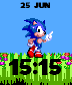
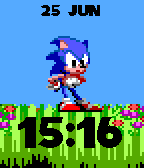
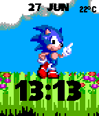
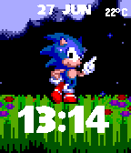
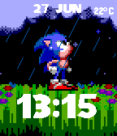
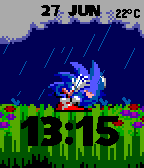
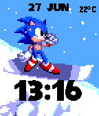

# Sonic-WatchFace
A very simple Sonic watchface for Pebble (Pebble Time only)

Shows the time in 12 or 24 hour format, and the date.

Animates on first launch, every 5 minutes and with a flick of the wrist.
Has multiple backgrounds and poses depending on weather and day/night.
(Looking up when it's raining, crouching when there is thunder, snowboarding)

TODO :
  - Config options

Credits :

  - SEGA for the Sonic characters and graphics.
  - Font found on http://www.neosaturn.com/sonicsite/segafonts.html
